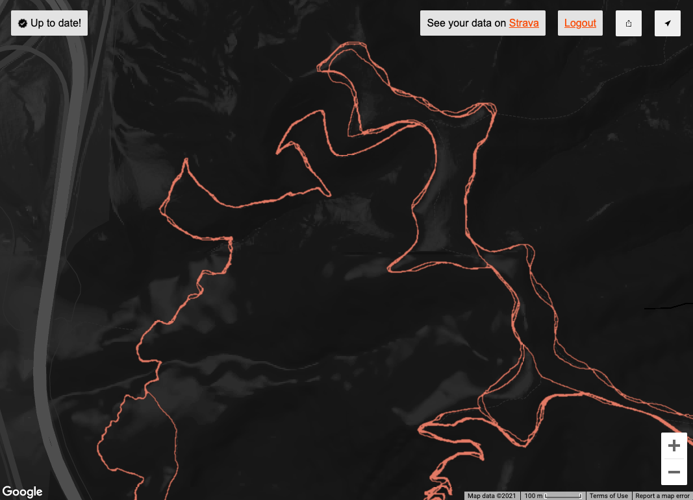

# Personal Strava Heatmap

The Personal Strava Heatmap is an application that enables users to pull data from Strava to compute a version of the [Global Strava Heatmap](https://www.strava.com/heatmap) that is based on their activity data. This offers athletes an opportunity to all of their activity data projected onto a single interactive map.

## Developer Docs

Check out the [Developer Documentation](./DEV_DOCS.md) if you want to run this locally.

## How it works

Users who authenticate to Strava and authorize the application to pull their activity data (using [OAuth](https://developers.strava.com/docs/authentication/)) will be able to view their personal activity data rendered ontop of Google Maps, similar to the [Global Strava Heatmap](https://www.strava.com/heatmap).

What makes this application unique is that it scales out for athletes who have mapped a lot of activities. The application will render an athletes heatmap for various [Google Maps Tiles](https://developers.google.com/maps/documentation/javascript/coordinates), which means that you can view detailed aggregate activity data in extremely fine-grained detail. A naive approach of plotting individual coordinates is slow, memory intensive, and will not scale for users with any substantial amount of activity data. 

## How it's built

The application has two main components.

An API server, written in Golang, hosts various public APIs as well as javascript and HTML files that enable users to view their personalized heatmap and also check the status of any on-going map re-builds. The API server also periodically checks for new Strava activities for each user and will trigger an asynchronous map re-build whenever a new activity is found.

An Azure Function, written in Python, is triggered when a user records a new activity. This component is responsible for crunching location data and producing the [Google Maps Tile](https://developers.google.com/maps/documentation/javascript/coordinates) images for all tiles in which the user has recorded an activity.

## Scaling

The scale challenge with this project lies in the map generation. Due to the nature of [Google Maps Tiles](https://developers.google.com/maps/documentation/javascript/coordinates), there are billions of possible tiles for which a piece of the map must be drawn. A typical user will have activity data in over 10,000 of these tiles, which means that for each new activity that athlete completes there will need to be about 10,000 images produced.

A variety of parallelism, caching and batching strategies are used to make this process fast and cheap. The API server will determine the relevant tile-set for a user and emit batches of 250 tiles using an Azure Storage Queue. The Azure Function is responsible for picking these messages off the queue and rendering each tile in the batch. At any given time, the system can auto-scale to process roughly 50 batches of 250 tiles at the same time. When the system is idle, there is no resource usage allocated towards generating tiles because Azure functions will scale down to zero instances.

## A few notes on privacy

 * Only activities which you have deemed as `public` in your Strava profile will be used for this heatmap
 * Activity data is encrypted at rest
 * Only you can see your personalized heatmap unless you explicitly decide to share the map publicly
 * If you revoke permissions for this application, you will no longer be able to see your heatmap
